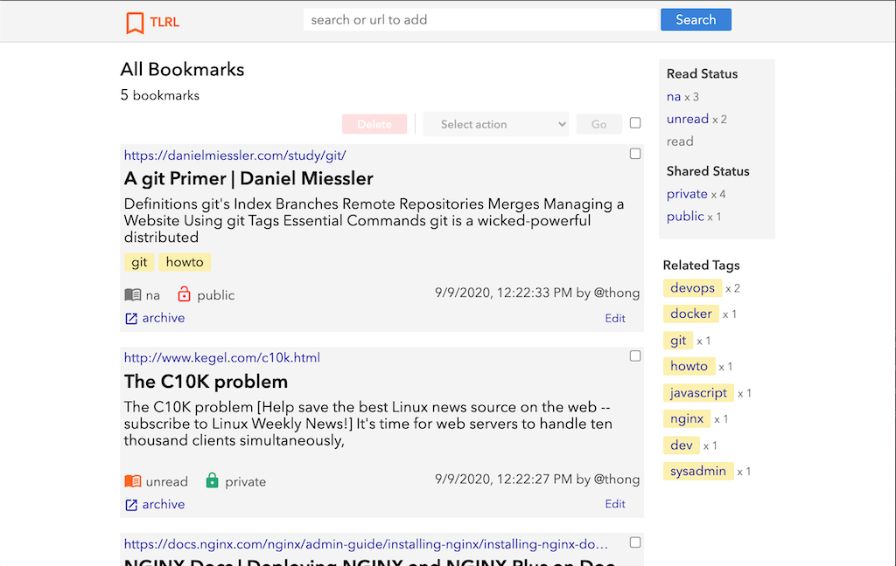

# TLRL
TLRL (_too long; read later_)&mdash;add, search and archive bookmarks. I use it to manage my bookmarks and to learn backend development, specifically on the [Spring](//spring.io)+[React](//reactjs.org) stack.

<a href="//raw.githubusercontent.com/ikumen/tlrl/master/docs/images/signin.png" target="_new"></a> <a
  href="//raw.githubusercontent.com/ikumen/tlrl/master/docs/images/all-bookmarks.png" target="_new"></a> <a
  href="//raw.githubusercontent.com/ikumen/tlrl/master/docs/images/editing.png" target="_new"></a>

### Start Here
- [Project Overview](#project-overview)
- Quick start
  - [Requirements](#requirements)
  - [Running TLRL](#running-tlrl)
  - [Development Setup](#development-setup)


## Project Overview
Here's a quick overview of the application architecture, project structure and code organization.

### Architecture
A high level view of the overall architecture.

```
                |                                                  |
                |                   TLRL                           |
                |   +-------------+               +-------------+  |
                |   | Spring App  |               |  PostgreSQL |  |
          +-------------+       <-^---------------^->           |  |
          |    React    |         |               +-------------+  |
          |   Web App   |-+       |   +-------+                    |    +-----+
          +-------------+ |       |   |       |   +------------+   |    |  +--+--+
                |   | +---V--+    |   | Kafka |   | Fetcher  <=^===^====|  | www |
+-------------+ |   | |      |  <-^---^->   <-^---^->          |   |    +--|     |
| Bookmarklet |-^---^-^->    |    |   |       |   +------+-----+   |       +-----+
+-------------+ |   | |  API |    |   +-------+          |         |
                |   | |      |    |               +------v-----+   |
                |   | |      |  <-^---------------^->  Solr    |   |
                |   | +------+    |               |   Search   |   |
                |   +-------------+               +------------+   |
                |                                                  |
                |                                                  |

```
The system consist of the following components:
- [Spring Boot](https://spring.io/projects/spring-boot) application that serves:
  - API for clients for managing bookmarks
  - [React](//reactjs.org) web client app (talks with our API)
  - [bookmarklet](https://en.wikipedia.org/wiki/Bookmarklet) for saving bookmarks (talks with our API)
- [PostgreSQL](https://www.postgresql.org/) database for persistence
- Fetcher for:
  - fetching bookmarked pages
  - converting fetched pages to pdf
  - extract fetched page text to Solr index
- [Solr](https://lucene.apache.org/solr/) provides search


### Structure and Organization
The project structure is a [monorepo](https://en.wikipedia.org/wiki/Monorepo), with sub projects resembling the components in the diagram above. A brief description of each sub project and code organization below:

- `backend` project containing the application (API, security) code and database schema. Maven style layout, with packages organized mostly by feature, then layer:
  - `bookmark` contains bookmark feature (e.g, self-contained controller, repository, service)
  - `security` security related code used across the overall application
  - `core` core domain/models used across the application
  - `support` helper/utilities used across the application
  - `user` user feature (e.g, self-contained repository, service)
- `frontend` project code for single page web client (and bookmarklet) that talks with the backend API. Note, we build the frontend and deploy it with the main application code. Typical `create-react-app` layout, organized mostly by layer:
  - `components`
  - `pages`
  - `support`
- `fetcher` project code for the Fetcher app, it runs standalone and organized as:
  - `index.js` main application entry point
  - `indexer.js` wrapper for Solr JSON api
  - `browser.js` wrapper for puppeteer
- `solr` configuration files for Solr search engine

## Quick Start
The quick start instructions are for running a demo of the application or getting started with development. In either case you'll need to fork/clone the project: https://github.com/ikumen/tlrl.git and the following requirements.

### Requirements
You'll need the following software:
- [Java 8 at a minimum](https://adoptopenjdk.net/)
- [Docker](https://www.docker.com/) with [docker-compose](https://docs.docker.com/compose/install/)
- configure at least one OAuth provider to handle authentication&mdash;GitHub may be easier to set up than Google as the latter requires creating a project if you don't already have one.

#### GitHub OAuth Config
1. sign into GitHub and navigate to: https://docs.github.com/en/developers/apps/creating-an-oauth-app
1. fill in anything for "Application Name", "Homepage URL" and "Application description"
1. fill in `http://localhost:9080/login/oauth2/code/github` for "Authorization callback URL"
1. and "Register application"
1. on the next screen, take note of the "Client ID" and "Client Secret", and continue below

#### Google OAuth Config
1. sign into Google Cloud Platform and navigate to: https://console.cloud.google.com/apis/credentials (you may need to create a project if you don't already have one)
1. click the "+ CREATE CREDENTIALS" button at the top
1. select "OAuth client ID"
1. on the next screen, select "Web application" for Application type
1. fill in anything for "Name"
1. add `http://localhost:9080` URI for "Authorized JavaScript origins"
1. add `http://localhost:9080/login/oauth2/code/google` URI for "Authorized redirect URIs"
1. and "Create", a "OAuth client created" dialog will pop up with your "Client ID" and "Client Secret", take note of it and continue below

#### Storing OAuth Config
Once you have the "Client ID" and "Client Secret", create a local `properties` file to store the secrets and make sure it doesn't get checked into source control.

Create the file at `backend/src/main/resources/application-local.yml` and add the following:

```yml
spring:
  security:
    oauth2:
      client:
        registration:
          google:
            client-id: <your-google-client-id>
            client-secret: <your-google-client-secret>
          github:
            client-id: <your-github-client-id>
            client-secret: <your-github-client-secret>
```
Technically you can name `application-local.yml` anything, but I've already configured the following:
  - `.gitignore` is already configured to ignore `application-local.yml`
  - `backend/src/main/resources/application.yml` is already configured to pull in the `local` profile

_Just remember to update the gitignore with your custom "local" file name, so it doesn't accidentally get committed._

### Running TLRL
To run a demo of TLRL (assuming you've completed the requirements above), we use `docker-compose`
to bring up the application and its dependent services.

```bash
docker-compose up zookeeper kafka solr nginx tlrl-app tlrl-fetcher
```

The build for all the dependent services, `fetcher` and the `backend` application should take several minutes. If all goes well, point your browser to http://localhost:9080 to check out the application. _Note, http://localhost:9080 is actually the proxy to the underlying app at http://localhost:8080._

### Development Setup
For development, you'll need to install `Nodejs/npm` in addition to the requirements above. I usually start the dependent services ...

```bash
docker-compose up zookeeper kafka solr tlrl-fetcher
```

then run the `backend` application manually as I'm developing.

```bash
# Install the frontend dependencies and build it (which copies it over to backend application for deployment)
npm install --prefix frontend && npm run build --prefix frontend
```
```bash
# Run the backend application
SPRING_PROFILES_ACTIVE=dev,h2 ./mvnw -f backend/pom.xml spring-boot:run -Ddb=h2
```

Point your browser to http://localhost:8080.

#### Using PostgreSQL in development

To run PostgreSQL in development vs the embedded H2, just run the included Docker image.

```bash
docker-compose up zookeeper kafka solr postgres tlrl-fetcher
```

Then run the [Flyway](https://flywaydb.org) migrations to create the schema.

```bash
FLYWAY_USER=postgres FLYWAY_PASSWORD=postgres ./mvnw -f backend/pom.xml flyway:migrate -Ddb=postgres
```

Next, run the `backend` application manually as before.

```bash
npm install --prefix frontend && npm run build --prefix frontend

SPRING_PROFILES_ACTIVE=dev,postgres TLRL_DB_USER=tlrladmin TLRL_DB_USER_PASSWORD=tlrladmin TLRL_DB_SERVER_HOSTNAME=localhost TLRL_DB_SERVER_PORT=5432 TLRL_DB_NAME=tlrldb ./mvnw -f backend/pom.xml spring-boot:run -Ddb=postgres
```


